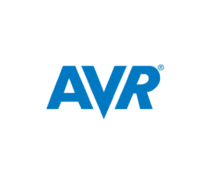
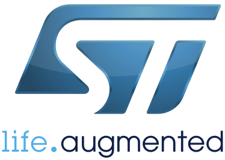
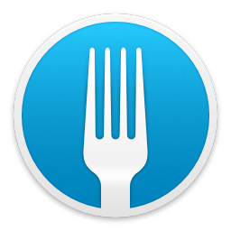
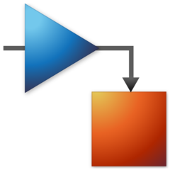
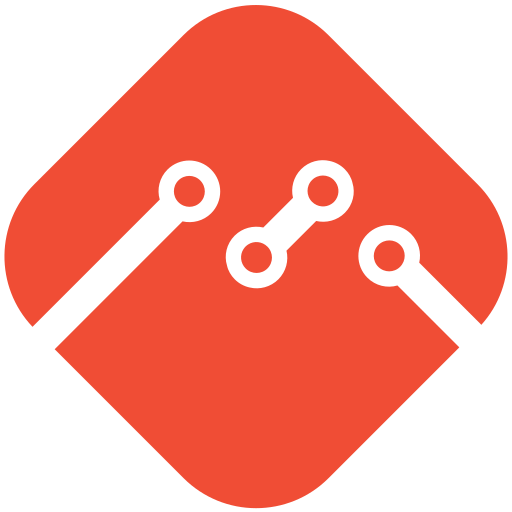

<h1> </h1>
<h1 align="center"> Hi there, I'm Marc :wave:
</h1> 

<h1> </h1>

- electrical engineering student at <a href="https://www.htwg-konstanz.de/hochschule/fakultaeten/elektro-und-informationstechnik/uebersicht/"> UAS Constance </a>  
- member of <a href="http://elaketric.de"> eLaketric Racing Team </a>  &emsp; 
- high interest in **Sensorsystems | Test & Measurement Automation with SCPI via VISA**  
- currently learning **CoAP | MQTT | REST API | RTOS | SQL**
 
<h1> </h1>

<h3 align="left">Languages:</h3>

 
     
     
     
     
    
     
    

<h1> </h1>

<h3 align="left">Plattforms:</h3>

    
    
    
    
    
    
    

<h1> </h1>

<h3 align="left">Tools & Technologies:</h3> 

    
    
    
    
    
    
    
    
    

